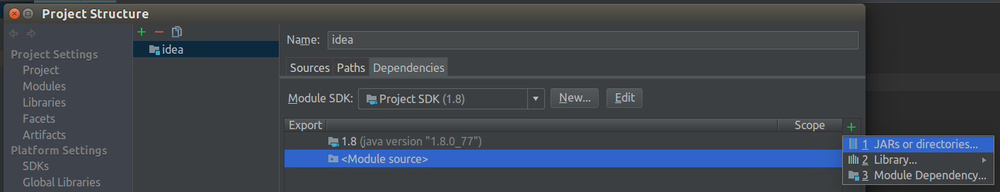

# Driver License Parser Library for Java
This project demonstrates how to use **Driver License Parser library for Java** from [IDScan.net](https://idscan.net/).

## Installation

### IDEA

1. Download the [latest version](https://idscan.net/solutions/enterprise/id-parsing-sdk/) of **Driver License Parser Library for Java** for target platform. The archive contains next components:
    + **linux_x86/linux_x86_64**  
        ```
        ./
        ├ dlparserlib.jar
        ├ libidscan_parser.so
        ```
    + **win32_x86/win32_x86_64**  
        ```
        ./
        ├ dlparserlib.jar
        ├ idscan_parser.dll
        ```

2. Add **libs** directory to the project and put into appropriate library files. The project structure looks like this:
    + **Linux**  
        ```
        - MODULE
        ├ src
        |   ...
        ├ libs  
          └ dlparserlib.jar
          └ idscan_parser.so
        ```  
        > **Note** you have to use **.so** matching your target platform(**x86** / **x86_64**).
    + **Windows**  
        ```
        - MODULE
        ├ src
        |   ...
        ├ libs  
          └ dlparserlib.jar
          └ idscan_parser.dll
        ```  
        > **Note** you have to use **.dll** matching your target platform(**x86** / **x86_64**).

3. Add **dlparserlib.jar** to the project as external **jar** file:
    + Open **module settings**(F4) dependencies tab.
    + '+' → JARs or directories...  
        
    + Select **dlparserlib.jar** and press OK.  
        

4. Setup **Dynamic Link Library**. **dlparserlib.jar** depends on a native library. You need to setup **java.library.path** variable so that Java VM can find the appropriate library.  
    

### Eclipse

1. Download the [latest version](https://idscan.net/solutions/enterprise/id-parsing-sdk/) of **Driver License Parser Library for Java** for target platform. The archive contains next components:
    + **linux_x86/linux_x86_64**  
        ```
        ./
        ├ dlparserlib.jar
        ├ libidscan_parser.so
        ```
    + **win32_x86/win32_x86_64**  
        ```
        ./
        ├ dlparserlib.jar
        ├ idscan_parser.dll
        ```

2. Add **libs** directory to the project and put into appropriate library files. The project structure looks like this:
    + **Linux**  
        ```
        - Project
        ├ src
        |   ...
        ├ libs  
          └ dlparserlib.jar
          └ idscan_parser.so
        ```  
        > **Note** you have to use **.so** matching your target platform(**x86** / **x86_64**).
    + **Windows**  
        ```
        - Project
        ├ src
        |   ...
        ├ libs  
          └ dlparserlib.jar
          └ idscan_parser.dll
        ```  
        > **Note** you have to use **.dll** matching your target platform(**x86** / **x86_64**).

3. Add **dlparserlib.jar** to the project as external **jar** file:
    + Open **project properties**(Alt + Enter) → **Java Build Path** → **libraries** tab.
    + Add JARs...  
        
    + Select **dlparserlib.jar** and press OK.  
        

4. Setup **Dynamic Link Library**. **dlparserlib.jar** depends on a native library. You need to setup **java.library.path** variable so that Java VM can find the appropriate library.
    + Open **project properties**(Alt + Enter) → **Java Build Path** → **libraries** tab.
    + Expand **dlparserlib.jar**, select **Native Library Location** and press **Edit...**
      
    + Select **PROJECT_NAME/libs** folder and press **Ok**.  
    

## Usage

1. Create ```DLParser``` object.  
```
DLParser parser = new DLParser();
```

2. Setup **License Key**. For setup **License Key** you need to call ```setup(String)```. It accepts license key encoded as Base64 string.  
```
try {
    parser.setup("** LICENSE_KEY **");
} catch(DLParserException e) {
    // TODO: handle the error.
}
```

3. Parse the data. For parsing data you need to call ```parse(byte[])``` method.
```
try {
    DLResult res = parser.parse(data);
} catch(DLParserException | UnsupportedEncodingException e) {
    // TODO: handle the error.
}
```

You will find a complete example of using the library in the ```Main.java```.
